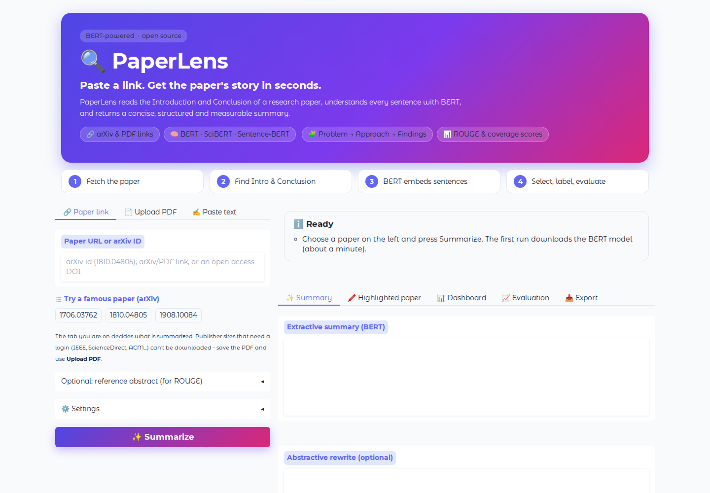
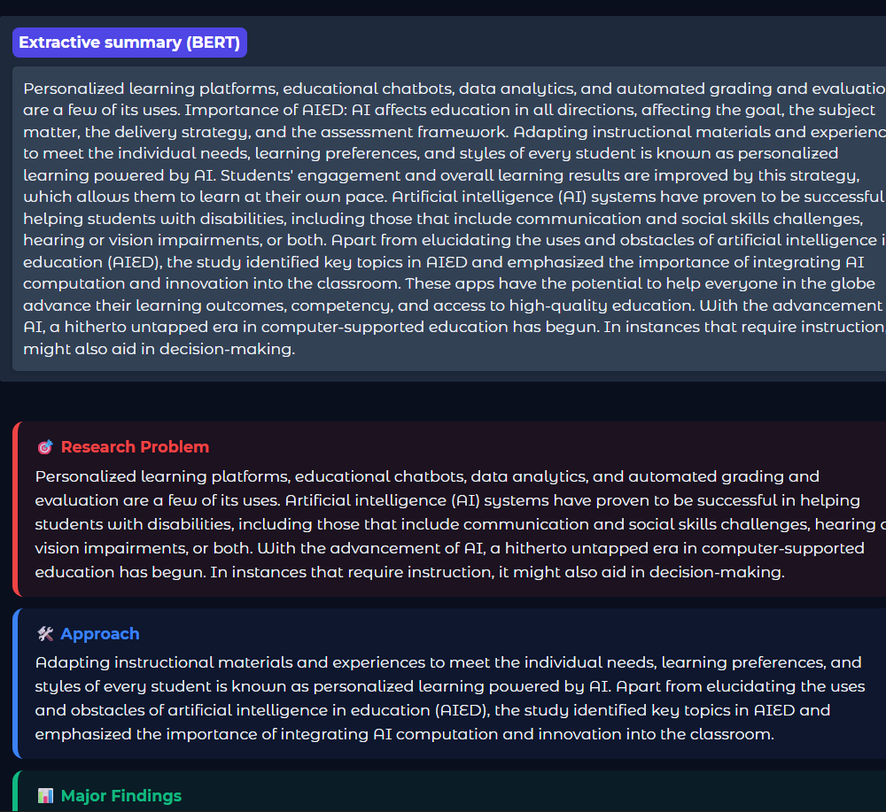
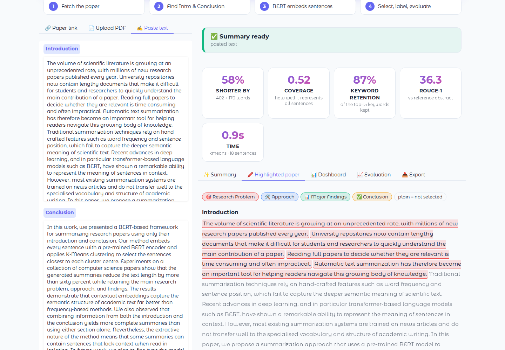
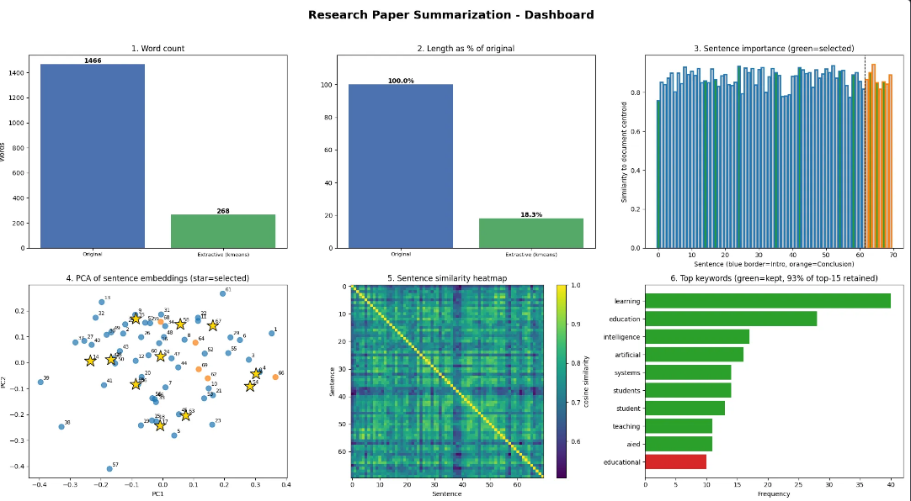
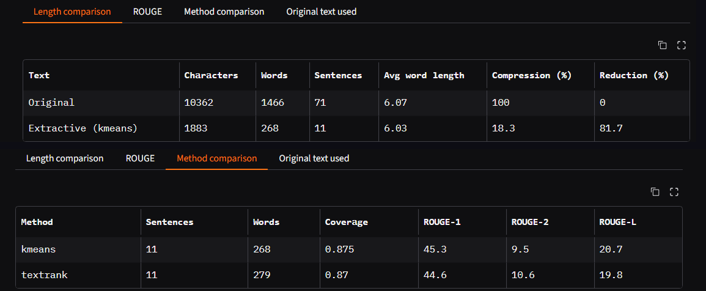
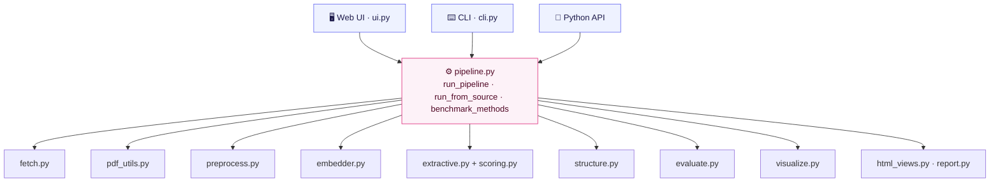

<div align="center">


<br/>


[](https://colab.research.google.com/github/YOUR_USERNAME/paperlens/blob/main/notebooks/Colab_Launcher.ipynb)

**[Case Study](#case-study) · [Demo](#demo) · [Quick Start](#quick-start) · [How It Works](#how-it-works) · [Usage](#usage) · [Evaluation](#evaluation) · [FAQ](#troubleshooting--faq)**

</div>

---

## Overview

**PaperLens** reads a research paper's **Introduction** and **Conclusion**, understands every sentence with a pre-trained **BERT** model, and returns a **concise, structured and measurable** summary. It is explainable too: you can see exactly which sentences were chosen and what role each one plays (research problem, approach, findings, conclusion).

> 📚 **This project is a case study** in applied NLP: *"Research Paper Abstract Summarization using a pre-trained BERT-based model in Google Colab with Python."* It starts from the assignment and grows into a complete, tested, deployable application.

<table>
<tr>
<td width="25%" align="center"><h3>🔗</h3><b>Paste a link</b><br/>arXiv id, DOI, PDF URL, or upload a PDF</td>
<td width="25%" align="center"><h3>🧠</h3><b>BERT understands</b><br/>BERT · SciBERT · Sentence-BERT</td>
<td width="25%" align="center"><h3>🧩</h3><b>Structured output</b><br/>Problem → Approach → Findings → Conclusion</td>
<td width="25%" align="center"><h3>📊</h3><b>Measured</b><br/>ROUGE, coverage, length comparison, dashboard</td>
</tr>
</table>

## Table of Contents
- [Case Study](#case-study)
- [Demo](#demo)
- [Features](#features)
- [Quick Start](#quick-start)
- [How It Works](#how-it-works)
- [Usage](#usage)
- [Supported Models](#supported-models)
- [Evaluation](#evaluation)
- [Project Structure](#project-structure)
- [Configuration](#configuration)
- [Testing](#testing)
- [Troubleshooting & FAQ](#troubleshooting--faq)
- [Limitations](#limitations)
- [Roadmap](#roadmap)
- [Tech Stack](#tech-stack)
- [References](#references)
- [Author](#author) · [License](#license)

---

## Case Study

### Problem statement
A university research repository contains lengthy research papers that make it difficult for students and researchers to quickly understand the main contribution of a paper. The task is to develop a **text summarization model using a pre-trained BERT-based model in Google Colab with Python** that generates a concise summary of a research paper.

| | |
|---|---|
| **Input** | Long research-paper content (Introduction and Conclusion) |
| **Output** | A concise summary highlighting the **research problem, approach, major findings and conclusion** |

### Requirements and where they are implemented

| # | Requirement | Status | Implementation |
|---|---|:---:|---|
| 1 | Take the **Introduction and Conclusion** of a paper as input | ✅ | `pdf_utils.py` finds both sections automatically in a PDF; you can also paste them |
| 2 | Use a **pre-trained BERT-based** summarization model | ✅ | `embedder.py` (BERT / SciBERT / Sentence-BERT) + `extractive.py` (K-Means / TextRank) |
| 3 | Generate a **concise summary** with the key research information | ✅ | `pipeline.py`, with `structure.py` labelling problem / approach / findings / conclusion |
| 4 | **Display** the original text and the generated summary | ✅ | *Summary*, *Highlighted paper* and *Original text* views in the web app |
| 5 | **Compare** original and summarized text lengths | ✅ | `evaluate.py`: characters, words, sentences, compression %, reduction % |
| ➕ | Graphs | ✅ | `visualize.py`: one 6-panel dashboard |
| ➕ | Runs in **Google Colab** | ✅ | [`notebooks/Colab_Launcher.ipynb`](notebooks/Colab_Launcher.ipynb) |

### Beyond the case study
Paper links (arXiv / DOI / PDF URL) · safe downloader · automatic section detection · PDF-glitch cleaning · sentence-quality scoring · embedding centering · role labelling · ROUGE evaluation · multi-paper benchmark · web UI · CLI · Python API · 32 automated tests · export to Markdown / JSON.

---

## Demo

### The app
<div align="center">

<br/><sub>Paste an arXiv id or link, upload a PDF, or paste the text. Pick a BERT model and press <b>Summarize</b>.</sub>
</div>

### Summary and structured view
<div align="center">

<br/><sub>Real output from a run with BERT on a review paper: the extractive summary and the colour-coded role cards.</sub>
</div>

### Highlighted paper: see why each sentence was chosen
<div align="center">

<br/><sub>Selected sentences are highlighted in the colour of their role. Everything else is dimmed. (Sample paper, offline baseline model.)</sub>
</div>

### Dashboard
<div align="center">

<br/><sub>Word count · compression · sentence centrality · PCA map of BERT embeddings · similarity heatmap · keyword retention.</sub>
</div>

### Evaluation tables
<div align="center">

<br/><sub>Length comparison and the K-Means vs TextRank comparison (early run: v1.0, <code>bert-base-uncased</code>, a 1,466-word Introduction + Conclusion).</sub>
</div>

---

## Features

| | Feature | Details |
|---|---|---|
| 🔗 | **Many inputs** | arXiv id or link, open-access DOI, direct PDF link, uploaded PDF or `.txt`, or pasted text |
| 🛡️ | **Safe downloader** | blocks private/internal addresses and redirects, 30 MB limit, friendly messages for login-only publishers |
| 📑 | **Section detection** | finds *Abstract*, *Introduction* and *Conclusion* by heading (handles `1.1` subsections and split heading lines) and warns before falling back |
| 🧹 | **PDF cleaning** | repairs ligature splits (`identifi ed`), hyphenation, `high -quality`, `..`, citations, URLs and table junk |
| 🧠 | **Pre-trained BERT encoders** | Sentence-BERT MiniLM (default), `bert-base-uncased`, SciBERT, or any Hugging Face BERT-style model |
| 🎯 | **Smart selection** | K-Means or TextRank on BERT embeddings, a sentence-quality score, a word budget, and a guaranteed share for the Conclusion |
| 🧩 | **Structured summary** | role labels from BERT similarity to prototype sentences |
| 🖍️ | **Explainable** | highlighted-paper view shows chosen sentences and their roles |
| 📊 | **Built-in evaluation** | ROUGE vs the paper's own abstract, coverage, keyword retention, length comparison, 6-panel dashboard |
| 🧪 | **Benchmark mode** | compare models and methods over many papers with one command |
| ✍️ | **Optional rewrite** | extract-then-abstract with DistilBART / BART (not BERT; BERT still chooses the content) |
| 📥 | **Export** | Markdown report and JSON |

---

## Quick Start

Pick **one** way to run PaperLens. **Google Colab needs no installation.**

### Option 1: Google Colab (no installation)

**1. Get the code.** Download or clone it, in Colab (replace `YOUR_USERNAME`):
```python
!git clone https://github.com/YOUR_USERNAME/paperlens.git
%cd paperlens
```
Prefer a zip? On GitHub click **Code → Download ZIP**, upload it with the 📁 icon in Colab's sidebar, then:
```python
!unzip -q -o paperlens-main.zip -d /content      # use your zip's real name
%cd /content/paperlens-main                      # and its real folder name
```

**2. Install the libraries** (1–3 minutes):
```python
!pip -q install -r requirements.txt
```

**3. Launch the app** with one cell. It starts PaperLens and a public link:
```python
!pkill -f app.py; pkill -f cloudflared
!nohup python -u app.py > app.log 2>&1 &
!sleep 20
!test -f /content/cloudflared || (wget -q https://github.com/cloudflare/cloudflared/releases/latest/download/cloudflared-linux-amd64 -O /content/cloudflared && chmod +x /content/cloudflared)
!nohup /content/cloudflared tunnel --url http://127.0.0.1:7860 > /content/cf.log 2>&1 &
!sleep 12
!grep -o "https://[a-z0-9-]*\.trycloudflare\.com" /content/cf.log | head -1
```
**4.** Open the `https://….trycloudflare.com` link that is printed. Type an arXiv id such as `1810.04805` and press **Summarize**.

> 💡 **Notes**
> - Links starting with `127.0.0.1` never open from your own computer. Use the public link.
> - The link changes every run and stops when the Colab session ends.
> - A GPU is optional: *Runtime → Change runtime type → T4 GPU*.
> - The first run downloads the BERT model (about a minute). Later runs are fast.
> - You can also open [`notebooks/Colab_Launcher.ipynb`](notebooks/Colab_Launcher.ipynb) which contains all of this.

<details>
<summary><b>No web link? Run it directly in a notebook cell</b></summary>

```python
from paperlens import SummarizerConfig, run_from_source, benchmark_methods
from paperlens.visualize import dashboard
from paperlens.html_views import role_cards, highlighted_text
from IPython.display import HTML
import matplotlib.pyplot as plt

res = run_from_source("1810.04805", SummarizerConfig())   # arXiv id, URL, or "/content/mypaper.pdf"
print(res.title, "\n\n" + res.extractive_summary)
display(HTML(role_cards(res))); display(HTML(highlighted_text(res)))
display(res.stats_df); display(res.rouge_df); display(benchmark_methods(res))
dashboard(res); plt.show()
```
</details>

### Option 2: Run on your own computer

**Requirements:** Python 3.10 or newer, about 2 GB of free disk space (the PyTorch library and the BERT model), and an internet connection for the first run. A GPU is not needed.

**1. Download the project**
```bash
git clone https://github.com/YOUR_USERNAME/paperlens.git
cd paperlens
```
or click **Code → Download ZIP** on GitHub, extract it, and open a terminal inside the folder.

**2. Create a virtual environment** (recommended)

| Windows (PowerShell) | macOS / Linux |
|---|---|
| `python -m venv .venv` | `python3 -m venv .venv` |
| `.venv\Scripts\Activate.ps1` | `source .venv/bin/activate` |

**3. Install**
```bash
pip install -r requirements.txt
```
*(Optional: to install as a package with the `paperlens` command, run `pip install -e .`)*

**4. Start the web app**
```bash
python app.py
```
Open **http://127.0.0.1:7860** in your browser. Add `--share` for a temporary public link.

### Option 3: Command line
```bash
python -m paperlens.cli 1810.04805                       # arXiv id  (or just: paperlens 1810.04805 after pip install -e .)
python -m paperlens.cli paper.pdf --model scibert --words 150 --out report.md --json out.json --plot dash.png
python -m paperlens.cli https://arxiv.org/abs/1706.03762 --benchmark
python -m paperlens.cli paper.pdf --model hashing        # offline baseline, no BERT download
```

### Option 4: Free public hosting
Deploy to **Hugging Face Spaces** so anyone can use it with a link and no setup. See [DEPLOY.md](DEPLOY.md).

---

## How It Works


### Step by step

| Step | What happens | Why |
|---|---|---|
| **1. Fetch** | `fetch.py` turns an arXiv id / DOI / link into a PDF and downloads it safely | One input box for any source |
| **2. Find sections** | `pdf_utils.py` locates *Abstract*, *Introduction* and *Conclusion* by their headings | The case study uses exactly these sections: they hold the problem, motivation and results |
| **3. Clean and split** | `preprocess.py` repairs PDF glitches and splits the text into sentences, protecting `et al.`, `e.g.`, `Fig.` | Garbage in, garbage out |
| **4. Embed** | A pre-trained BERT-style encoder turns each sentence into a vector (mean pooling, L2-normalised) | Similar meaning gives similar vectors |
| **5. Centre** | The average vector is subtracted | Raw BERT vectors all point in a similar direction, so every sentence looks alike; centring restores contrast |
| **6. Select** | **K-Means** groups sentences into topics and picks the best one per topic, or **TextRank** ranks them on a similarity graph. A *quality score* prefers self-contained sentences. A word budget is split between Introduction and Conclusion | Covers all main ideas with little repetition |
| **7. Label** | Each chosen sentence is compared with prototype sentences for each role | Gives the *problem / approach / findings / conclusion* structure |
| **8. Measure** | Lengths, ROUGE, coverage, keyword retention, dashboard | Evidence that the summary is concise *and* faithful |

### Key ideas in plain words
- **BERT** (*Bidirectional Encoder Representations from Transformers*) reads a sentence using the words on both sides of each word, so it captures meaning in context. It was pre-trained on Wikipedia and BooksCorpus, so no training is needed here (**transfer learning**).
- **Extractive summarization** copies the most important sentences from the paper, so every statement in the summary comes from the authors. This avoids invented facts.
- **K-Means** is a clustering algorithm; each cluster is a topic and the sentence closest to its centre is the best representative.
- **Cosine similarity** measures how close two sentence vectors are (1 = same meaning).
- **ROUGE** measures word overlap between a summary and a reference (here, the paper's own abstract).

### Architecture


---

## Usage

### Input options (web app)

| Tab | Accepts | Examples |
|---|---|---|
| 🔗 **Paper link** | arXiv id or link, open-access DOI, direct PDF URL | `1810.04805` · `https://arxiv.org/abs/1706.03762` · `https://example.org/paper.pdf` |
| 📄 **Upload PDF** | a PDF or `.txt` file from your computer | any paper you have downloaded |
| ✍️ **Paste text** | the Introduction and Conclusion typed or pasted | for papers where automatic detection fails |

> ⚠️ **The tab you are on decides what is summarized.** Publisher sites that need a login (IEEE Xplore, ScienceDirect, ACM, Wiley, Springer …) block automatic downloads. Open the paper in your browser, save the PDF, and use the **Upload PDF** tab.

### Settings

| Setting | Meaning |
|---|---|
| **BERT model** | which encoder reads the sentences (see [Supported Models](#supported-models)) |
| **Selection method** | `kmeans` (topic representatives) or `textrank` (graph ranking) |
| **Target summary length** | approximate size in words (60–400, default 180) |
| **Share from the Conclusion** | how much of the summary comes from the Conclusion (default 40%) |
| **Prefer self-contained sentences** | turns the quality score on or off |
| **Abstractive rewrite** | optional DistilBART / BART rewrite of the selected sentences |
| **Compare K-Means vs TextRank** | adds a comparison table |

### What you get
`Summary` · `Structured cards` · `Highlighted paper` · `Dashboard` · `Evaluation tables` · `Markdown + JSON export`

### Python API
```python
from paperlens import SummarizerConfig, run_from_source

cfg = SummarizerConfig(embedding_model="allenai/scibert_scivocab_uncased", method="kmeans", target_words=150)
res = run_from_source("1810.04805", cfg)          # path, URL or arXiv id

print(res.title)
print(res.extractive_summary)
print(res.structured)        # {"Research Problem": [...], "Approach": [...], ...}
print(res.stats_df)          # length comparison
print(res.rouge_df)          # ROUGE vs the paper's abstract
print(res.coverage, res.keyword_retention)
```

### CLI options

| Option | Meaning |
|---|---|
| `paper` | path to a PDF/.txt, a URL, or an arXiv id |
| `--model` | `minilm` (default), `bert`, `scibert`, `hashing`, or any Hugging Face id |
| `--method` | `kmeans` or `textrank` |
| `--words N` | target summary length |
| `--abstractive` | also rewrite with DistilBART |
| `--benchmark` | compare K-Means and TextRank |
| `--reference-file F` | use your own reference abstract for ROUGE |
| `--out F` · `--json F` · `--plot F` | save Markdown report, JSON, dashboard PNG |

---

## Supported Models

| Name in the app | Hugging Face id | Size | Best for |
|---|---|---|---|
| **Sentence-BERT MiniLM** *(default)* | `sentence-transformers/all-MiniLM-L6-v2` | ~90 MB | fast, strong sentence similarity |
| **BERT base** | `bert-base-uncased` | ~440 MB | the classic model from the case study |
| **SciBERT** | `allenai/scibert_scivocab_uncased` | ~440 MB | scientific vocabulary |
| **Baseline (no BERT)** | built-in word-count hashing | 0 | offline use and as a comparison baseline |
| *Any BERT-style model* | pass the id with `embedding_model=` | – | your own experiments |

Optional rewrite models: `sshleifer/distilbart-cnn-12-6` (fast), `facebook/bart-large-cnn` (better, slower). These are BART models, not BERT.

---

## Evaluation

| Metric | Meaning |
|---|---|
| **Shorter by (Reduction %)** | how much shorter the summary is than the Introduction + Conclusion text (not the whole paper) |
| **ROUGE-1 / 2 / L** | word overlap (F1 %) with the paper's own abstract. Useful for comparing settings, not as absolute truth |
| **Coverage** | average best-match similarity between every sentence and the summary (0–1) |
| **Keyword retention** | share of the 15 most frequent content words found in the summary |

**Example run** (early v1.0, `bert-base-uncased`, one review paper on AI in education; 71 sentences, 1,466 words):

| Method | Words | Reduction | Coverage | ROUGE-1 | ROUGE-2 | ROUGE-L |
|---|---:|---:|---:|---:|---:|---:|
| K-Means | 268 | 81.7% | 0.875 | 45.3 | 9.5 | 20.7 |
| TextRank | 279 | 81.0% | 0.870 | 44.6 | 10.6 | 19.8 |

> One paper is not a benchmark, and v1.0 used raw (uncentred) embeddings, so coverage values are not comparable with v1.1. Run the multi-paper benchmark to get results you can cite:

```bash
python scripts/evaluate_models.py --pdf-dir papers/ --models hashing,minilm,bert,scibert --methods kmeans,textrank --plot bench.png
```
It prints mean ROUGE, coverage and reduction per model and method, saves a CSV, and optionally a chart.

---

## Project Structure

```
paperlens/
├── app.py                    # launches the web app
├── requirements.txt          # runtime dependencies
├── requirements-dev.txt      # + pytest, reportlab
├── pyproject.toml            # package metadata, `paperlens` command
├── DEPLOY.md  CHANGELOG.md  LICENSE  README.md
├── paperlens/                # the package
│   ├── config.py             # model lists + SummarizerConfig
│   ├── fetch.py              # arXiv / DOI / URL downloader (SSRF-safe)
│   ├── pdf_utils.py          # PDF reading, section + title detection
│   ├── preprocess.py         # cleaning + sentence splitting
│   ├── embedder.py           # BERT embedder (mean pooling) + offline baseline
│   ├── extractive.py         # K-Means, TextRank, centring, coverage
│   ├── scoring.py            # sentence-quality score
│   ├── structure.py          # problem / approach / findings / conclusion
│   ├── abstractive.py        # optional DistilBART/BART rewrite
│   ├── evaluate.py           # lengths, ROUGE, keywords
│   ├── pipeline.py           # end-to-end orchestration
│   ├── visualize.py          # 6-panel dashboard
│   ├── html_views.py         # UI cards and highlighted text
│   ├── report.py             # Markdown / JSON export
│   ├── ui.py                 # Gradio web app
│   ├── cli.py                # command-line tool
│   └── sample.py             # built-in demo paper
├── tests/                    # 32 automated tests
├── scripts/                  # evaluate_models.py, make_sample_pdf.py
├── notebooks/                # Colab_Launcher.ipynb
├── sample_data/              # sample_paper.pdf
└── docs/                     # banner and screenshots
```

---

## Configuration

`SummarizerConfig` (in `paperlens/config.py`):

| Option | Default | Meaning |
|---|---|---|
| `embedding_model` | `sentence-transformers/all-MiniLM-L6-v2` | any BERT-style Hugging Face id, or `"hashing"` |
| `method` | `"kmeans"` | `"kmeans"` or `"textrank"` |
| `target_words` | `180` | approximate summary length (40–800) |
| `conclusion_share` | `0.4` | share of the summary taken from the Conclusion (0.1–0.7) |
| `use_quality` | `True` | prefer self-contained, informative sentences |
| `center_embeddings` | `True` | subtract the mean vector for sharper similarities |
| `max_input_sentences` | `120` | safety cap per section |
| `abstractive` | `False` | add a seq2seq rewrite |
| `abstractive_model` | `sshleifer/distilbart-cnn-12-6` | model used for the rewrite |

---

## Testing

```bash
pip install -r requirements-dev.txt
python -m pytest -q
```
**32 tests** cover cleaning, section detection, the downloader (using a local test server), DOI and arXiv handling, selection algorithms, the pipeline, reports, HTML escaping, the UI function and the benchmark script. They run **offline**, using the built-in no-BERT embedder. BERT models are only downloaded when you actually run the app.

---

## Troubleshooting & FAQ

| Problem | Cause and fix |
|---|---|
| `127.0.0.1:7860` refuses to connect (Colab) | That address is Colab's own machine. Open the public `trycloudflare.com` or `gradio.live` link instead |
| `504 Gateway Time-out` on a `gradio.live` link | Gradio's free tunnel is unreliable at times. Use the Cloudflare cell in [Quick Start](#option-1-google-colab-no-installation), or run the notebook version |
| *"The link did not return a PDF"* / *"needs a login"* | The publisher blocks scripts (IEEE, ScienceDirect, …). Download the PDF in your browser and use **Upload PDF** |
| *"Links to private/internal addresses are not allowed"* | Update to v1.1.1 or later (DOI handling was fixed) |
| Uploaded a PDF but still got a link error | Make sure you are on the **Upload PDF** tab (v1.1.1+ uses the active tab) |
| Warning: *"Introduction heading not found"* | The paper uses unusual headings. PaperLens used the first/last part of the text; for best results use **Paste text** |
| *"Very little text was extracted"* | The PDF is a scan. Run OCR first, for example `ocrmypdf in.pdf out.pdf` |
| First run is slow | It is downloading the BERT model (90–440 MB). Later runs are fast |
| `ModuleNotFoundError: paperlens` | You are not inside the project folder. `cd paperlens` (or `%cd /content/paperlens` in Colab) |
| Colab disconnected | Re-run the install and launch cells; the public link changes each time |

---

## Limitations

Being honest about what this does *not* do:

- **Extractive sentences can lack context.** Copied sentences such as *"These apps have the potential…"* may refer to something that was not selected.
- **Role labels are heuristic.** They come from similarity to example sentences plus light rules, not a trained classifier, so they can be wrong, especially for review papers.
- **Section detection depends on headings.** Unusual layouts, two-column interleaving and scanned PDFs may need the fallback or manual paste.
- **Only open-access links can be downloaded.** Paywalled pages cannot.
- **ROUGE against an abstract rewards word overlap only.** Use it to compare settings, not to prove quality.
- **Evidence is limited.** Run the benchmark on many papers before drawing conclusions about which model is best.

## Roadmap

- [ ] Fine-tune on arXiv / PubMed summaries
- [ ] BERTScore and a small human evaluation
- [ ] Penalise sentences that start with unresolved pronouns (*"It", "These"*)
- [ ] MMR redundancy control
- [ ] Summarise the full paper in chunks, not only Introduction and Conclusion
- [ ] Batch mode for a whole folder or repository
- [ ] Hosted demo on Hugging Face Spaces
- [ ] GitHub Actions to run the tests on every push

---

## Tech Stack

| Area | Technology |
|---|---|
| **Language** | Python 3.10+ |
| **Models** | BERT, SciBERT, Sentence-BERT (MiniLM); optional DistilBART / BART |
| **ML frameworks** | PyTorch, Hugging Face Transformers |
| **Algorithms** | scikit-learn (K-Means, PCA), TextRank, cosine similarity |
| **Documents** | pypdf, regular expressions, urllib |
| **Evaluation** | rouge-score and custom coverage / keyword metrics |
| **Data & charts** | NumPy, pandas, Matplotlib, tabulate |
| **Interface** | Gradio, custom HTML/CSS |
| **Quality** | pytest, reportlab (sample PDF) |
| **Run & share** | Google Colab, Cloudflare Tunnel, Hugging Face Spaces, Git/GitHub |

## References

1. Devlin, Chang, Lee, Toutanova. *BERT: Pre-training of Deep Bidirectional Transformers for Language Understanding.* NAACL 2019. [arXiv:1810.04805](https://arxiv.org/abs/1810.04805)
2. Vaswani et al. *Attention Is All You Need.* NeurIPS 2017. [arXiv:1706.03762](https://arxiv.org/abs/1706.03762)
3. Reimers, Gurevych. *Sentence-BERT: Sentence Embeddings using Siamese BERT-Networks.* EMNLP 2019. [arXiv:1908.10084](https://arxiv.org/abs/1908.10084)
4. Beltagy, Lo, Cohan. *SciBERT: A Pretrained Language Model for Scientific Text.* EMNLP 2019. [arXiv:1903.10676](https://arxiv.org/abs/1903.10676)
5. Mihalcea, Tarau. *TextRank: Bringing Order into Text.* EMNLP 2004.
6. Lin. *ROUGE: A Package for Automatic Evaluation of Summaries.* ACL Workshop 2004.
7. Lewis et al. *BART: Denoising Sequence-to-Sequence Pre-training.* ACL 2020. [arXiv:1910.13461](https://arxiv.org/abs/1910.13461)

---

## Author

**YOUR NAME**
GitHub: [@YOUR_USERNAME](https://github.com/YOUR_USERNAME)

Built as a case study on *Research Paper Abstract Summarization* using pre-trained BERT.

## License

Released under the [MIT License](LICENSE). Contributions and ideas are welcome: open an issue or a pull request.

<div align="center">

⭐ **If PaperLens helped you, please star the repository!** ⭐

</div>
